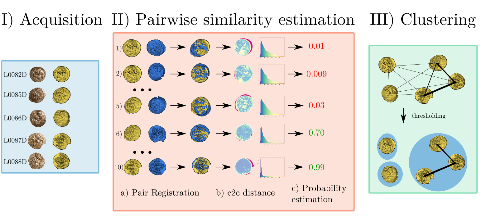
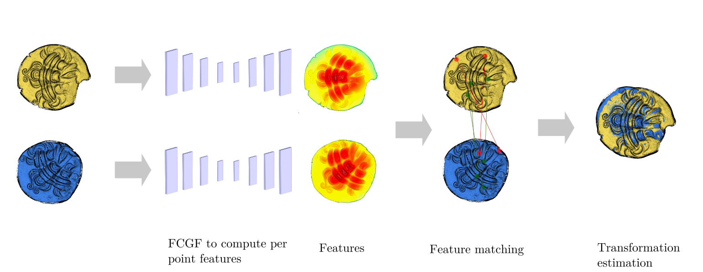

# Riedones3D


It is the code to perform coin die recognition and die clustering. More information on this [article](https://arxiv.org/abs/2109.15033).

## Installation
requirements:
```
pyrender==0.1.45
hydra-core==1.0.0
omegaconf==2.0.6
scikit-learn==0.24.2
torch-cluster==1.5.9
torch-scatter==2.0.7
torch-geometric==1.7.2
torch==1.8.1
torch_points_kernels
torch-points3d==1.3.0
MinkowskiEngine==0.5.2
torch-sparse==1.4.0
omegaconf==2.0.6
hydra-core==1.0.0
open3d==0.12.0
```
First install anaconda or miniconda (use this [website](https://docs.conda.io/en/latest/miniconda.html) for example)

then open a terminal.

create a new environnement (for example using conda)
 ```
 conda create -n "riedones_3d"
 ```
 ```
 conda activate riedones_3d
 ```
 execute this script to install the correct packages(here we install with cuda102)
 ```
pip install pyrender
pip install trimesh
pip install networkx
pip install torch==1.8.1
pip install torch-scatter -f https://data.pyg.org/whl/torch-1.8.1+cu102.html
pip install torch-sparse -f https://data.pyg.org/whl/torch-1.8.1+cu102.html
pip install torch-cluster -f https://data.pyg.org/whl/torch-1.8.1+cu102.html
pip install torch-spline-conv -f https://data.pyg.org/whl/torch-1.8.1+cu102.html
pip install torch-geometric==1.7.2
pip install git+https://github.com/humanpose1/deeppointcloud-benchmarks.git@registration/riedones3d
```
install [minkowski engine](https://github.com/NVIDIA/MinkowskiEngine) (it works with version 0.5.3)
```
apt-get install build-essential python3-dev libopenblas-dev
pip install -U git+https://github.com/NVIDIA/MinkowskiEngine --no-deps
 ```
 install [torch-sparse](https://github.com/mit-han-lab/torchsparse)
 ```
 apt-get install libsparsehash-dev
 pip install --upgrade git+https://github.com/mit-han-lab/torchsparse.git@v1.4.0
 ```
 
 install [TEASER++](https://github.com/MIT-SPARK/TEASER-plusplus)
 ```
git clone https://github.com/MIT-SPARK/TEASER-plusplus.git
cd TEASER-plusplus && mkdir build && cd build
cmake -DTEASERPP_PYTHON_VERSION=3.8 .. && make teaserpp_python
cd python && pip install .
 ```
 
## Dataset
The Riedones3D dataset is available on the [website](https://npm3d.fr/coins-riedones3d).

## Preprocessing
As input, we need point cloud in ply format. We propose a simple script to convert from stl to ply with normals(if you already have point cloud in ply, you do not need this step).

```
python scripts/mesh2pcd.py --path_coin mymesh.stl
```

## Register a pair of coin

It will register the pair and it will also compute the histogram of distance. It displays the results with open3D.
The following script shows the Pairwise similarity estimation.

```
python scripts/whole_pipeline.py --path COIN1.ply COIN2.ply -m PATH OF THE MODEL --angle 0 --trans 20  --clf classifiers/logistic_part_droits_sym.pkl --path_scaler classifiers/mean_std.json --est ransac
```
 You can download the model [here](https://cloud.mines-paristech.fr/index.php/s/iRIuRAD48PjIIuf). 
 <details>
<summary>The password is:</summary>
 !riedones3D
</details>

## Coin die Clustering

### Compute the features

First you need to compute the features:
```
python scripts/compute_feature.py --path_coin DROITS --list_coin Coins_et_Monnaies_Droits_all.csv -m PATH OF THE MODEL --path_output results --name Droits
```
It takes few minutes to compute every features.
Then we can estimate the transformation
### compute a pair similarity comparison
```
python scripts/compute_transformation.py --path_feature results/Droits/feature/  --path_output results/Droits/transformation --list_coin Coins_et_Monnaies_Droits_all.csv --num_points 5000 --est ransac --n_jobs 8 --sym
```

`--sym` means the histogram is symmetric.
`--num_points` is the number of points
`--est` is the robust estimator to compute the transformation
It takes few days to compute every similarities
it will generate two files:
- a file containing every transformations
- a file containing every histograms of distance

### Compute the Graph

We compute the graph of similarity between the pairs of coins
```
python scripts/compute_graph_from_hist.py --path_histogram results/Droits/transformation/hist.npy -m classifiers/logistic_part_droits_sym.pkl -o results/Droits/graph --path_scaler classifiers/mean_std.json
```
### Clean the graph using graph visualizer

You can select links nodes, remove/add links, search for a node cluster the results, save the graph.

TODO: Tutorial about how to use graph visualizer

### generate images and 3D models
You can use the script render_coins in order to render images (require trimesh, pyrender and open3d).
```
python scripts/render_coins.py --path_coin PATH COIN --path_tr PATH transfo npy --path_graph PATH GRAPH json --path_output PATH OUTPUT -t THRESH --clustered --save-3d
```
`--path_coin` is the path of directories containing the coins. WARNING: It must be meshes in STL format.

`--path_tr` is the path of the file containing the transformations. It is a npy format `transfo.npy`.

`--path_graph` is the path containing the graph. It is a json format `graph.json`

`--path_output` path where the 3d data and images will be stored.

`-t` threshold of the graph for the clustering (see the effect in the graph visualizer).

`--clustered` to save file by folder.

`--save_3d` save 3d files (if you do not want to save the 3d files, use instead `--no-save-3d`).


If you find this repo helpful, please cite:
```
@inproceedings {horache2021riedones3d,
booktitle = {Eurographics Workshop on Graphics and Cultural Heritage},
editor = {Hulusic, Vedad and Chalmers, Alan},
title = {{Riedones3D: a Celtic Coin Dataset for Registration and Fine-grained Clustering}},
author = {Horache, Sofiane and Deschaud, Jean-Emmanuel and Goulette, François and Gruel, Katherine and Lejars, Thierry and Masson, Olivier},
year = {2021},
publisher = {The Eurographics Association},
ISBN = {978-3-03868-141-0},
pages = {83-92},
DOI = {10.2312/gch.20211410}
}
```


